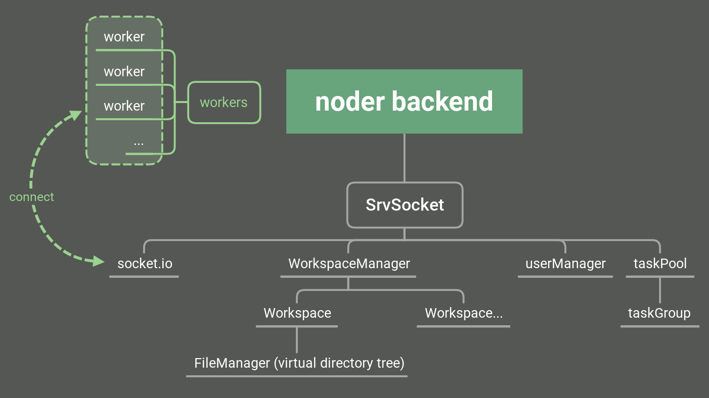

# Noder Backend
**[isn't done yet] A node-based image/video/audio editor (backend)**  
It is a server for clients(frontend).  
**plan:**  

**todo:**  
> - [ ] Preliminary complete `NodeType`
> - [ ] Preliminary complete `NodeManager`
> - [x] replace `WebSocket` to `socket.io`
> - [ ] use `socket.io` to manage users   
> ...
> - [ ] code cleanup
> - [ ] improve performance
> - [ ] document

**License**
> GPL3